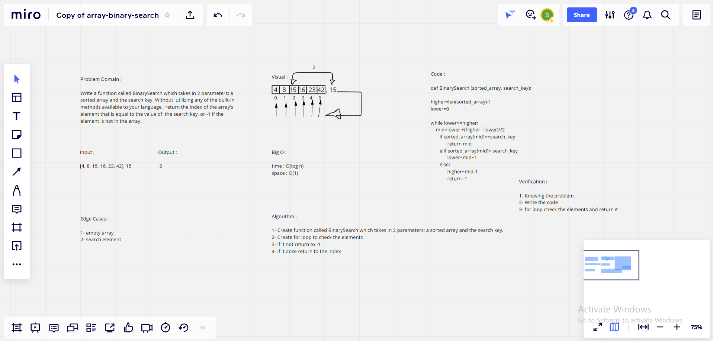

# Binary Search of Sorted Array

***Write a function called BinarySearch which takes in 2 parameters: a sorted array and the search key. Without utilizing any of the built-in methods available to your language, return the index of the array’s element that is equal to the value of the search key, or -1 if the element is not in the array.*** 

## Whiteboard Process

## Approach & Efficiency
> What approach did you take? 

*Algorithm approach* 

 > Discuss Why. What is the Big O space/time for this approach ?  

*Time : O(1), Becuase: it requires constant time to perform operations like to reach an element in constant time as in case of dictionary*

*Space : O(n), Becuase: it depends on the value of n to perform operations such as searching an element in an array of n elements.*