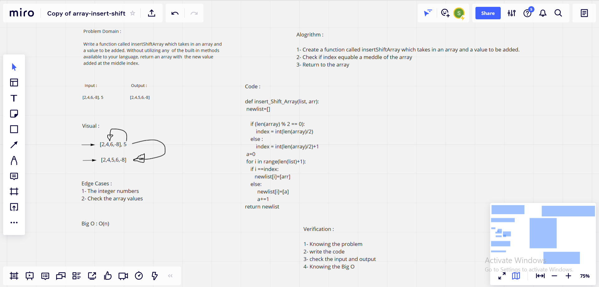

# Insert to Middle of an Array
***Write a function called insertShiftArray which takes in an array and a value to be added. Without utilizing any of the built-in methods available to your language, return an array with the new value added at the middle index.*** 

## Whiteboard Process

## Approach & Efficiency

> What approach did you take? 

*Algorithm approach* 

> Discuss Why. What is the Big O space/time for this approach ?  

*O(n), Becuase: Executes linearly and proportionally to the size of the input*
