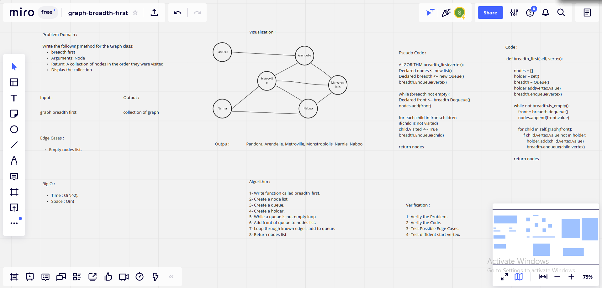

# Challenge Summary

### Feature Tasks

*Write the following method for the Graph class:*

* breadth first
* Arguments: Node
* Return: A collection of nodes in the order they were visited.
* Display the collection

## Whiteboard Process

## Approach & Efficiency

### What approach did you take?

*Algorithm.*

### Why?

*Because : It is a Graph.*

### What is the Big O space/time for this approach? -->

*Time : O(N^2) : Because : We have a while loop, this loops through N times based on the number of nodes in our graph.*

*Space : O(n) : Because : Number of spaces is unknown.*

## Solution

        def breadth_first(self, vertex):
            nodes = []
            holder = set()
            breadth = Queue()
            holder.add(vertex.value)
            breadth.enqueue(vertex)

            while not breadth.is_empty():
                front = breadth.dequeue()
                nodes.append(front.value)

                for child in self.graph[front]:
                    if child.vertex.value not in holder:
                        holder.add(child.vertex.value)
                        breadth.enqueue(child.vertex)

            return nodes

| Subject     | links |
| ----------- | ----------- |
| graph_breadth_first| [graph_breadth_first/graph_breadth_first.py](graph_breadth_first/graph_breadth_first.py) |
| test_graph_breadth_first | [tests/test_graph_breadth_first.py](tests/test_graph_breadth_first.py) |