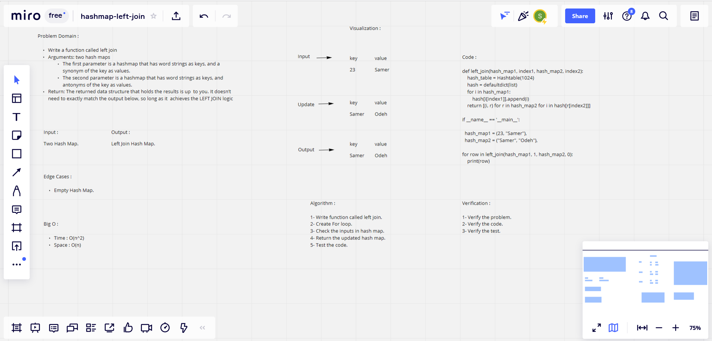

# Hashmap LEFT JOIN

## Challenge

### Feature Tasks

> Write a function that LEFT JOINs two hashmaps into a single data structure.

* Write a function called left join

* Arguments: two hash maps

1. The first parameter is a hashmap that has word strings as keys, and a synonym of the key as values.

1. The second parameter is a hashmap that has word strings as keys, and antonyms of the key as values.

* Return: The returned data structure that holds the results is up to you. It doesn’t need to exactly match the output below, so long as it achieves the LEFT JOIN logic

## Approach & Efficiency

### What approach did you take? 

*Algorithm.*

### Why? 

*Because : It is Hash Map.*

### What is the Big O space/time for this approach? 

**Time : O(n^2) : Because : The basic operation of this algorithm is comparison. This will happen n * (n-1) number of times…concluding the algorithm to be n squared.**

**space : O(n) : Because : Unknown number of spaces.**

## Solution

| Subject     | links |
| ----------- | ----------- |
| hashmap_left_join | [hashmap_left_join/hashmap_left_join.py](hashmap_left_join/hashmap_left_join.py) |
| test_hashmap_left_join | [tests/test_hashmap_left_join.py](tests/test_hashmap_left_join.py) |