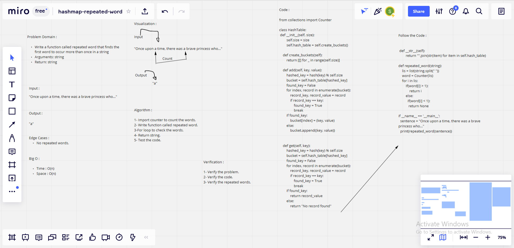

# Challenge Summary

### Feature Tasks

* Write a function called repeated word that finds the first word to occur more than once in a string
* Arguments: string
* Return: string

## Whiteboard Process

## Approach & Efficiency

### What approach did you take? 

*Algorithm.*

### Why? 

*Because it is Hashmap.*

### What is the Big O space/time for this approach?

*Time : O(n) : Because : Instead of counting a number of occurrences of each word which will have O(N) time and space complexity, where N is number of words, we can stop when the count of any word becomes 2. That is no need to iterate through all the words in string.*

*Space : O(n) : Because : Instead of counting a number of occurrences of each word which will have O(N) time and space complexity, where N is number of words, we can stop when the count of any word becomes 2. That is no need to iterate through all the words in string.*

## Solution

    from collections import Counter

    def repeated_word(string):
        lis = list(string.split(" "))
        word = Counter(lis)
        for i in lis:
            if(word[i] > 1):
                return i
            else:
            if(word[i] < 1):
            return None
    
    if __name__ == '__main__':
    sentence = "Once upon a time, there was a brave princess who..."
    print(repeated_word(sentence)) 

| Subject     | links |
| ----------- | ----------- |
| hashmap_repeated_word | [hashmap_repeated_word/hashmap_repeated_word.py](hashmap_repeated_word/hashmap_repeated_word.py) |
| test_hashmap_repeated_word | [tests/test_hashmap_repeated_word.py](tests/test_hashmap_repeated_word.py) |