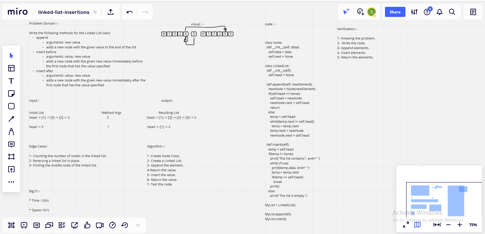

# Challenge Summary

## Feature Tasks

### Write the following methods for the Linked List class:

* append
1. arguments: new value
1. adds a new node with the given value to the end of the list

* insert before
1. arguments: value, new value
1. adds a new node with the given new value immediately before the first node that has the value specified

* insert after
1. arguments: value, new value
1. adds a new node with the given new value immediately after the first node that has the value specified

## Whiteboard Process

## Approach & Efficiency

What approach did you take ?

* Algorithm

### Why ?

* Becuase is Inserting a new element into a singly linked list

### What is the Big O space/time for this approach? -->

* Time : O(n), Because : Only one traversal of the list is needed.

* Space: O(1), Because : No extra space is needed.

## Solution
 
      class Node:
       def __init__(self, data):
        self.data = data
        self.next = None

      class LinkedList:
       def __init__(self):
        self.head = None

       def append(self, newElement):
        newNode = Node(newElement)
        if(self.head == None):
        self.head = newNode
        newNode.next = self.head
      return
        else:
         temp = self.head
         while(temp.next != self.head):
         temp = temp.next
         temp.next = newNode
         newNode.next = self.head

      def insert(self):
       temp = self.head
       if(temp != None):
       print("The list contains:", end=" ")
       while (True):
        print(temp.data, end=" ")
        temp = temp.next
        if(temp == self.head):
          break
      print()
    else:
      print("The list is empty.")

     if __name__=="__main__":
    
     MyList = LinkedList()

     MyList.append(5)
     MyList.insert()

| Subject     | links |
| ----------- | ----------- |
| Linked list insertions | [linked_list_insertions/linked_list_insertions.py](linked_list_insertions/linked_list_insertions.py) |
| Test Linked list insertions | [tests/test_linked_list_insertions.py](tests/test_linked_list_insertions.py) |