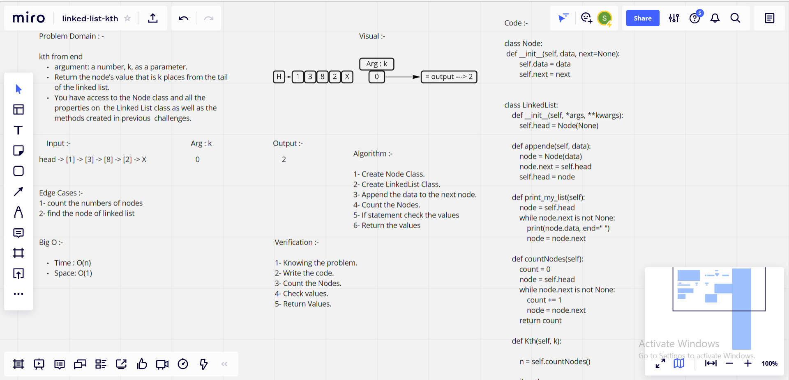

# Challenge Summary

## Feature Tasks

### Write the following method for the Linked List class:

* kth from end

1. argument: a number, k, as a parameter.
2. Return the node’s value that is k places from the tail of the linked list.
3. You have access to the Node class and all the properties on the Linked List class as well as the methods created in previous challenges.

## Whiteboard Process

## Approach & Efficiency

### What approach did you take ? Why ?

* Algorithm, Because it is kth Linked List

### What is the Big O space/time for this approach ?

* Time : O(n), Because : Only one traversal of the list is needed.

* Space: O(1), Because : No extra space is needed.

## Solution

     class Node:
    def __init__(self, data, next=None):
        self.data = data
        self.next = next

    class LinkedList:
    def __init__(self, *args, **kwargs):
        self.head = Node(None)

    def appende(self, data):
        node = Node(data)
        node.next = self.head
        self.head = node

    # Print linked list
    def print_my_list(self):
        node = self.head
        while node.next is not None:
            print(node.data, end=" ")
            node = node.next

    # count number of node in linked list
    def countNodes(self):
        count = 0
        node = self.head
        while node.next is not None:
            count += 1
            node = node.next
        return count

    def Kth(self, k):

        # Count nodes in linked list
        n = self.countNodes()

        # check if k is valid
        if n < k:
            return
  
        if (2 * k - 1) == n:
            return

        x = self.head
        x_prev = Node(None)
        for i in range(k - 1):
            x_prev = x
            x = x.next
        
        y = self.head
        y_prev = Node(None)
        for i in range(n - k):
            y_prev = y
            y = y.next
       
        if x_prev is not None:
            x_prev.next = y

        # Same thing applies to y_prev
        if y_prev is not None:
            y_prev.next = x
        
        temp = x.next
        x.next = y.next
        y.next = temp

        # Change head pointers when k is 1 or n
        if k == 1:
            self.head = y

        if k == n:
            self.head = x

     if __name__ == '__main__':

     My_List = LinkedList()
    for i in range(8, 0, -1):
    My_List.appende(i)
    My_List.print_my_list()

    for i in range(1, 9):
    My_List.Kth(i)
    print("Modified List for k = ", i)
    My_List.print_my_list()
    print("\n")

| Subject     | links |
| ----------- | ----------- |
| Linked List kth | [linked_list_kth/linked_list_kth.py](linked_list_kth/linked_list_kth.py) |
| Test Linked List kth | [tests/test_linked_list_kth.py](tests/test_linked_list_kth.py) |