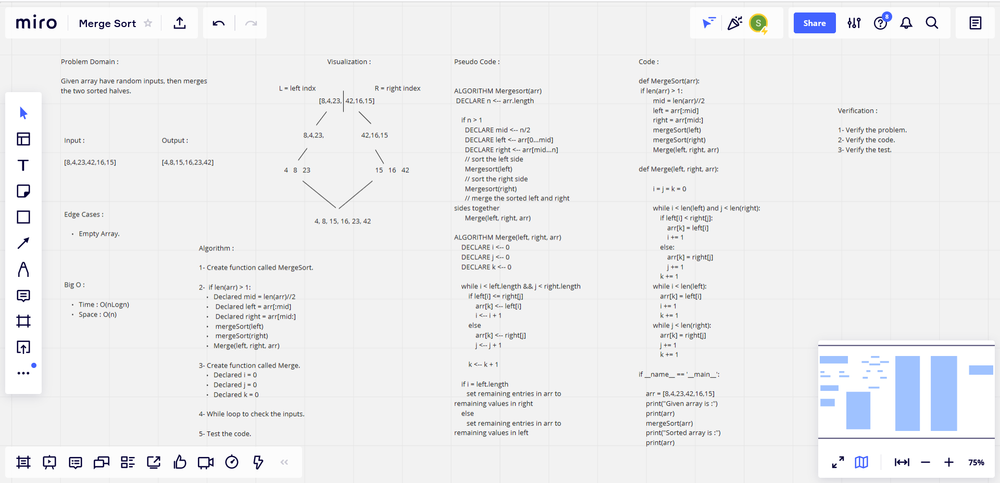

# Challenge Summary

**Given array have random inputs, then merges the two sorted halves.**

## Whiteboard Process

## Approach & Efficiency

### What approach did you take ?

*Algorithm*

### Why? 

*Because it is Merge Sort*

### What is the Big O space/time for this approach? 

*Time : O(nLogn) : Because : merge sort always divides the array into two halves and takes linear time to merge two halves.*

*Space : O(n) : Because : the number of spaces is unknown.*

## Solution

    def mergeSort(arr):
        if len(arr) > 1:

            mid = len(arr)//2

            left = arr[:mid]

            right = arr[mid:]

            mergeSort(left)
            mergeSort(right)
            Merge(left, right, arr)

    def Merge(left, right, arr):

            i = 0
            j = 0 
            k = 0

            while i < len(left) and j < len(right):
                if left[i] < right[j]:
                    arr[k] = left[i]
                    i += 1
                else:
                    arr[k] = right[j]
                    j += 1
                k += 1

            while i < len(left):
                arr[k] = left[i]
                i += 1
                k += 1

            while j < len(right):
                arr[k] = right[j]
                j += 1
                k += 1

    if __name__ == '__main__':
        arr = [8,4,23,42,16,15]
        print("Given array is :")
        print(arr)
        mergeSort(arr)
        print("Sorted array is :")
        print(arr)

| Subject     | links |
| ----------- | ----------- |
| merge_sort | [merge_sort/merge_sort.py](merge_sort/merge_sort.py) |
| test_merge_sort | [tests/test_merge_sort.py](tests/test_merge_sort.py) |
| BLOG | [BLOG.md](BLOG.md) |