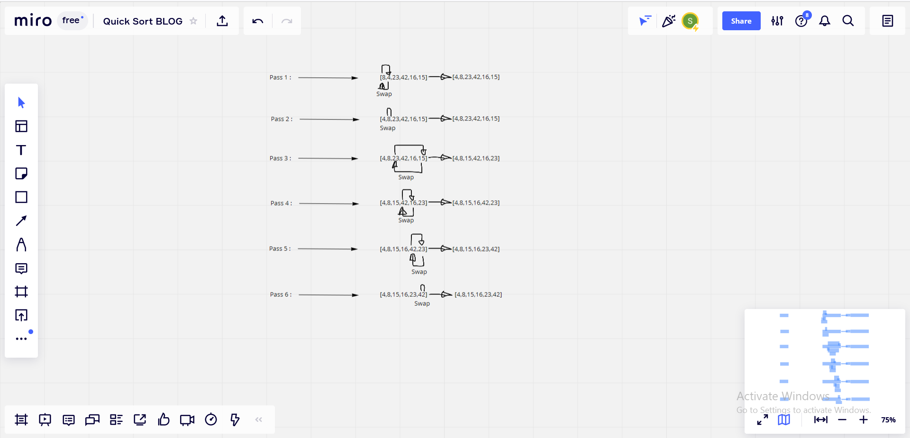

# Pseudocode 

    SelectionSort(int[] arr)
        DECLARE n <-- arr.Length;
        FOR i = 0; i to n - 1  
            DECLARE min <-- i;
            FOR j = i + 1 to n
                if (arr[j] < arr[min])
                    min <-- j;

            DECLARE temp <-- arr[min];
            arr[min] <-- arr[i];
            arr[i] <-- temp;

# Trace 

## Sample Array: [8,4,23,42,16,15]

### solution step by step :

