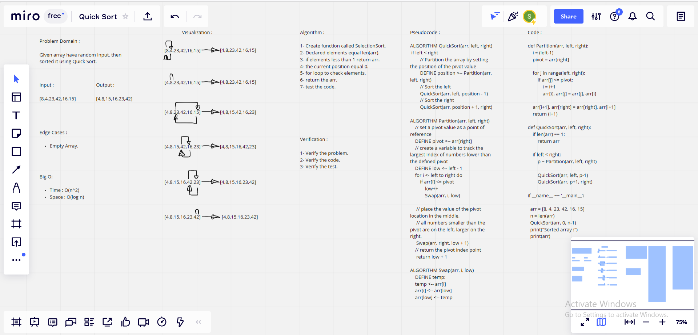

# Challenge Summary

**Given array have random input, then sorted it using Quick Sort.**

## Whiteboard Process

## Approach & Efficiency

> What approach did you take ? 

**Algorithm**

> Why ? 

**Because it is Quick Sort**

> What is the Big O space/time for this approach ?

**Time: O(n^2) : Because : The basic operation of this algorithm is comparison. This will happen n * (n-1) number of times…concluding the algorithm to be n squared.**

**Space: O(log n).**

## Solution

    def Partition(arr, left, right):
        i = (left-1)        
        pivot = arr[right]     
    
        for j in range(left, right):
            if arr[j] <= pivot:
                i = i+1
                arr[i], arr[j] = arr[j], arr[i]

        arr[i+1], arr[right] = arr[right], arr[i+1]
        return (i+1)
    
    def QuickSort(arr, left, right):
        if len(arr) == 1:
            return arr

        if left < right:
            p = Partition(arr, left, right)

            QuickSort(arr, left, p-1)
            QuickSort(arr, p+1, right)

    if __name__ == '__main__':

    arr = [8, 4, 23, 42, 16, 15]
    n = len(arr)
    QuickSort(arr, 0, n-1)
    print("Sorted array :")
    print(arr)

| Subject     | links |
| ----------- | ----------- |
| quick_sort | [quick_sort/quick_sort.py](quick_sort/quick_sort.py) |
| test_quick_sort | [tests/test_quick_sort.py](tests/test_quick_sort.py) |
| BLOG | [BLOG.md](BLOG.md) |