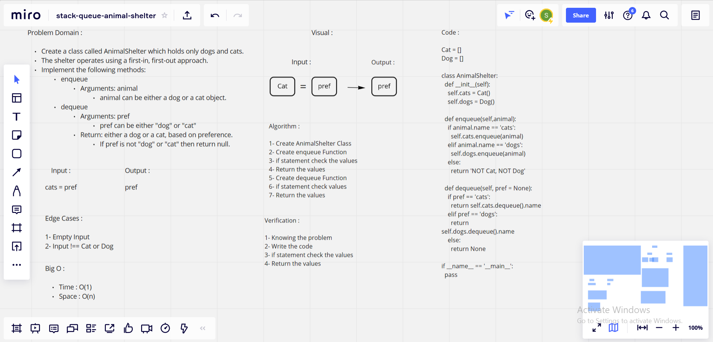

# Challenge Summary

1. Create a class called AnimalShelter which holds only dogs and cats.
2. The shelter operates using a first-in, first-out approach.
3. Implement the following methods:

* enqueue

1. Arguments: animal
2. animal can be either a dog or a cat object.
        
* dequeue

1. Arguments: pref
2. pref can be either "dog" or "cat"
3. Return: either a dog or a cat, based on preference.
4. If pref is not "dog" or "cat" then return null.

## Whiteboard Process

## Approach & Efficiency

## Approach & Efficiency

> What approach did you take ? 

* Algorithm 

> Why ?  

* Because it is stack-and-queue class

> What is the Big O space/time for this approach ? 

**Time : O(1)**

**Space : O(n)**

## Solution

        Cat = []
        Dog = []

        class AnimalShelter:
        def __init__(self):
            self.cats = Cat()
            self.dogs = Dog()

        def enqueue(self,animal):
            if animal.name == 'cats':
            self.cats.enqueue(animal)
            elif animal.name == 'dogs':
            self.dogs.enqueue(animal)
            else: 
            return 'NOT Cat, NOT Dog'

        def dequeue(self, pref = None):
            if pref == 'cats':
            return self.cats.dequeue().name
            elif pref == 'dogs':
            return self.dogs.dequeue().name
            else: 
            return None 

        if __name__ == '__main__':
        pass

| Subject     | links |
| ----------- | ----------- |
| stack-queue-animal-shelter | [stack_queue_animal_shelter/stack_queue_animal_shelter.py](stack_queue_animal_shelter/stack_queue_animal_shelter.py) |
| test_stack_queue_animal_shelter | [tests/test_stack_queue_animal_shelter.py](tests/test_stack_queue_animal_shelter.py) |