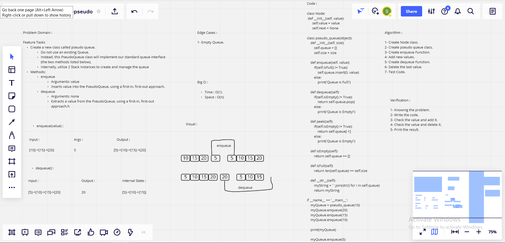

# Challenge Summary

### Feature Tasks

* Create a new class called pseudo queue.
1. Do not use an existing Queue.
2. Instead, this PseudoQueue class will implement our standard queue interface (the two methods listed below),
3. Internally, utilize 2 Stack instances to create and manage the queue
    
* Methods:

**enqueue**
            
1. Arguments: value
2. Inserts value into the PseudoQueue, using a first-in, first-out approach.
        
**dequeue**

1. Arguments: none
2. Extracts a value from the PseudoQueue, using a first-in, first-out approach.h

## Whiteboard Process

## Approach & Efficiency

> What approach did you take ? 

* Algorithm 

> Why ?  

* Because it is stack-queue-pseudo

> What is the Big O space/time for this approach ? 

**Time : O(1)**

**Space : O(n)**

## Solution

            class Node:
                def __init__(self, value):
                    self.value = value
                    self.next = None

                class pseudo_queue(object):
                    def __init__(self, size):
                        self.stack1=[]
                        self.stack2=[]
                        self.queue = []
                        self.size = size

                    def enqueue(self, value):
                        if(self.isFull() != True):
                            self.queue.insert(0, value)
                        else:
                            print('Queue is Full!')

                    def dequeue(self):
                        if(self.isEmpty() != True):
                            return self.queue.pop()
                        else:
                            print('Queue is Empty!')

                    def peek(self):
                        if(self.isEmpty() != True):
                            return self.queue[-1]
                        else:
                            print('Queue is Empty!')

                    def isEmpty(self):
                        return self.queue == []

                    def isFull(self):
                        return len(self.queue) == self.size

                    def __str__(self):
                        myString = ' '.join(str(i) for i in self.queue)
                        return myString

                if __name__ == '__main__':
                    myQueue = pseudo_queue(10)
                    myQueue.enqueue(20)
                    myQueue.enqueue(15)
                    myQueue.enqueue(10)

                    print(myQueue)

                    myQueue.enqueue(5)

                    print(myQueue)

                    myQueue.dequeue()

                    print(myQueue)

| Subject     | links |
| ----------- | ----------- |
| stack-queue-pseudo | [stack-queue-pseudo.py](stack-queue-pseudo.py) |