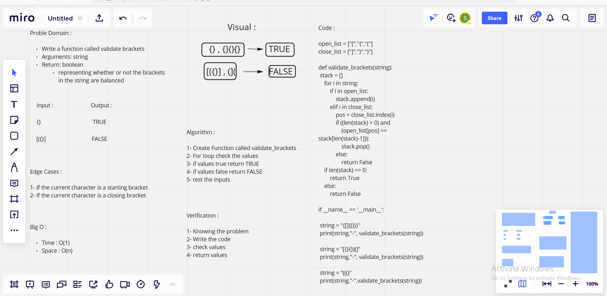

# Challenge Summary

1. Write a function called validate brackets
2. Arguments: string
3. Return: boolean

* *representing whether or not the brackets in the string are balanced*

## Whiteboard Process

## Approach & Efficiency

> What approach did you take ? 

* Algorithm 

> Why ?  

* Because it is stack-and-queue Function 

> What is the Big O space/time for this approach ? 

**Time : O(1)**

**Space : O(n)**

## Solution

        open_list = ["[","{","("]
        close_list = ["]","}",")"]

        def validate_brackets(string):
            stack = []
            for i in string:
                if i in open_list:
                    stack.append(i)
                elif i in close_list:
                    pos = close_list.index(i)
                    if ((len(stack) > 0) and
                        (open_list[pos] == stack[len(stack)-1])):
                        stack.pop()
                    else:
                        return False
            if len(stack) == 0:
                return True
            else:
                return False

        if __name__ == '__main__':

        string = "{[]{()}}"
        print(string,"-", validate_brackets(string))
        
        string = "[{}{})(]"
        print(string,"-", validate_brackets(string))
        
        string = "((()"
        print(string,"-",validate_brackets(string))

| Subject     | links |
| ----------- | ----------- |
| stack-queue-brackets | [stack_queue_brackets/stack-queue-brackets.py](stack_queue_brackets/stack-queue-brackets.py) |
| test_stack-queue-brackets | [tests/test_stack-queue-brackets.py](tests/test_stack-queue-brackets.py) |