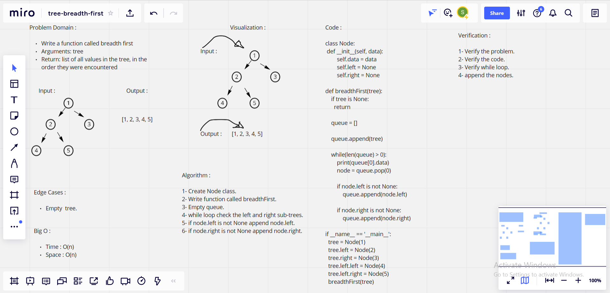

# Challenge Summary

### Feature Tasks

* Write a function called breadth first
* Arguments: tree
* Return: list of all values in the tree, in the order they were encountered

## Whiteboard Process

## Approach & Efficiency

> What approach did you take ?

**Breadth-first approach**

> Why ? 

**Because it is Breadth-first tree**
 
> What is the Big O space/time for this approach ?

**Time : O(n) Because : n is the number of nodes in the binary tree**

**Space : O(n) Because : n is the number of nodes in the binary tree**

## Solution

        class Node:
            def __init__(self, data):
                self.data = data
                self.left = None
                self.right = None
        
        def breadthFirst(tree):
            if tree is None:
            return 

            queue = []

            queue.append(tree)

            while(len(queue) > 0):
                print(queue[0].data)
                node = queue.pop(0)

                if node.left is not None:
                    queue.append(node.left)

                if node.right is not None:
                    queue.append(node.right)
        
        if __name__ == '__main__':
        tree = Node(1)
        tree.left = Node(2)
        tree.right = Node(3)
        tree.left.left = Node(4)
        tree.left.right = Node(5)
        breadthFirst(tree)  

| Subject     | links |
| ----------- | ----------- |
| tree_breadth_first | [tree_breadth_first/tree_breadth_first.py](tree_breadth_first/tree_breadth_first.py) |
| test_tree_breadth_first | [tests/test_tree_breadth_first.py](tests/test_tree_breadth_first.py) |

