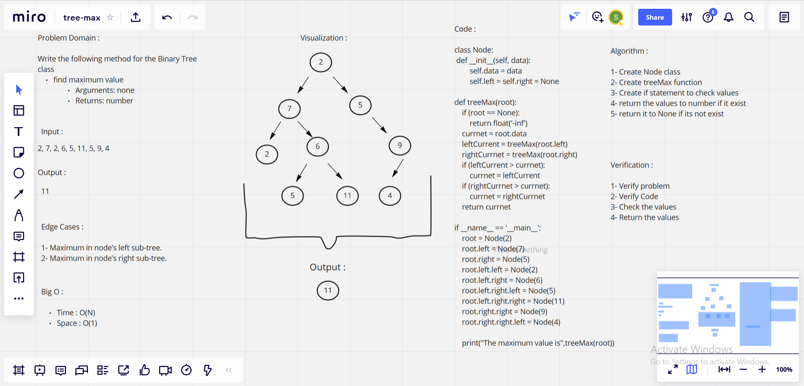

# Challenge Summary

### Feature Tasks

* Write the following method for the Binary Tree class

**find maximum value**
        
1. Arguments: none
2. Returns: number

## Whiteboard Process

## Approach & Efficiency

> What approach did you take ?

**Algorithm**

> Why ?

**Because it is Python Binary Tree**

> What is the Big O space/time for this approach ?

**Time : O(N) : Because : node of the tree is processed once and hence the complexity due to the function is if there are total N nodes in the tree.** 

**Space : O(1) : Because : Any extra space is not required.**

## Solution

        class Node:
            def __init__(self, data):
                self.data = data
                self.left = self.right = None
        
        def treeMax(root):
            if (root == None):
                return float('-inf')
            currnet = root.data
            leftCurrent = treeMax(root.left)
            rightCurrnet = treeMax(root.right)
            if (leftCurrent > currnet):
                currnet = leftCurrent
            if (rightCurrnet > currnet):
                currnet = rightCurrnet
            return currnet
        
        if __name__ == '__main__':
            root = Node(2)
            root.left = Node(7)
            root.right = Node(5)
            root.left.left = Node(2)
            root.left.right = Node(6)
            root.left.right.left = Node(5)
            root.left.right.right = Node(11)
            root.right.right = Node(9)
            root.right.right.left = Node(4)
            
            print("The maximum value is",treeMax(root))

| Subject     | links |
| ----------- | ----------- |
| tree-max | [tree_max/tree_max.py](tree_max/tree_max.py) |
| test-tree-max | [tests/test_tree_max.py](tests/test_tree_max.py) |